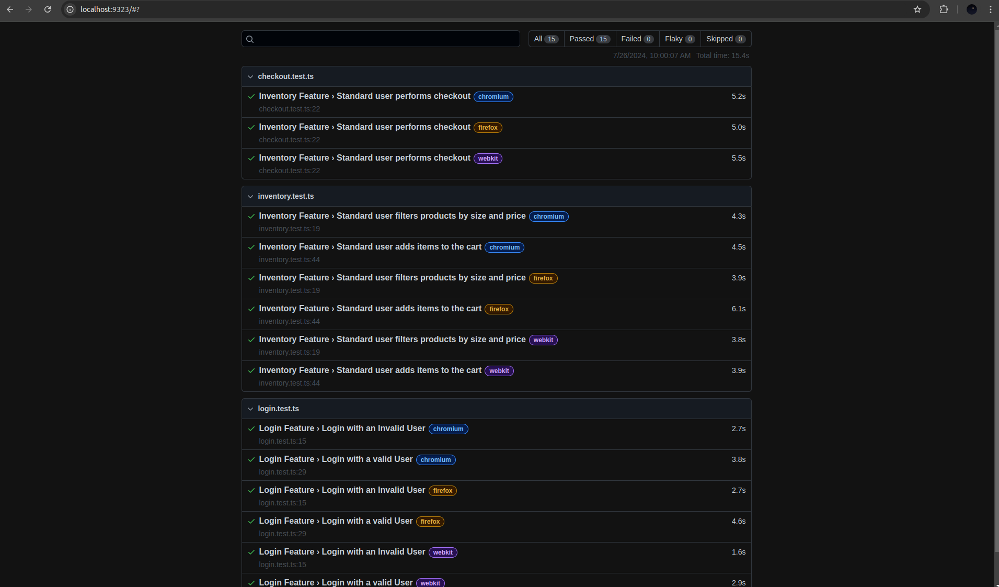

## Description

This is a small demo project that automates the tests for [SwagLabs V1](https://www.saucedemo.com/v1/index.html) using the test automation framework [Playwright](https://playwright.dev/) with Typescript following POM(page object model)

## Test Structure

### `tests`

The `tests` directory contains all the test files that can be executed.

```bash
├─ tests
│  ├─ checkout.test.ts
│  ├─ inventory.test.ts
│  └─ login.test.ts
```

### `pages`

The `pages` directory holds the different page objects representing the Swaglabs UI. Each file includes selectors and actions for interacting with the respective page.

```bash
├─ pages
│  ├─ CartPage.ts
│  ├─ CheckoutPage.ts
│  ├─ InventoryPage.ts
│  ├─ LoginPage.ts
│  └─ Sidebar.ts
```

### `data`

The `data` directory contains shared data such as user credentials and other information that can be used across different test files. Centralizing this data helps scale tests and improves manageability.

```bash
├─ data
│  ├─ cartData.ts
│  ├─ sortType.ts
│  └─ userCredentials.json
```

### `utils`

The `utils` directory includes helper files and functions used throughout the tests, facilitating code reuse and maintenance.

```bash
└─ utils
   ├─ Navigation.ts
   ├─ authHelper.ts
   └─ sortHelper.ts
```

### `playwright-report`

The `playwright-report` directory contains the HTML reporter generated after a test run. This report provides a comprehensive overview of the test results, allowing you to filter by browsers, passed tests, failed tests, skipped tests, and flaky tests.

```bash
├─ playwright-report
│  └─ index.html
```

### `playwright.config.ts`

The `playwright.config.ts` file is the main configuration file for Playwright.

```bash
├─ playwright.config.ts
```

This structure helps in organizing the test automation framework, making it easier to scale, maintain, and manage tests effectively.

## How to Run the Tests

### 1. Install Dependencies

First, install the required npm packages:

```bash
npm ci
```

### 2. Install Playwright Browsers

Next, install the necessary Playwright browsers and dependencies:

```bash
npx playwright install --with-deps
```

### 3. Run All Tests

The quickest way to run all the tests is with:

```bash
npx playwright test
```

To run the tests in UI mode, use:

```bash
npx playwright test --ui
```

Alternatively, you can use:

```bash
npm run test:e2e
```

### 4. Run a Single Test File

To run a specific test file, use the following command, replacing `<path-to-test-file>` with the path to your test file:

```bash
npm run test:e2e:single <path-to-test-file>
# Example: npm run test:e2e:single tests/login.test.ts
```

> **Note:** By default, the tests run in headless mode and parallel execution is handled automatically by Playwright. Environment variables can be used to customize the test run.

### 5. Run Tests in Headed Mode

Set the `PLAYWRIGHT_HEADLESS` environment variable to `false` to run tests in headed mode:

```bash
PLAYWRIGHT_HEADLESS=false npm run test:e2e
```

> **Note:** Currently, tests are configured to run only in the `chromium` browser. The steup for `firefox`, and `webkit` browser is also done in the config file but is commented. Please uncomment those lines if you want to run other browsers as well. One thing to note is depending on the operating system used extra host package installation might be necessary for correct browser to work

### 6. Run with a Single Worker

Playwright automatically assigns multiple workers based on the machine's capability for parallel test execution. To use a specific number of workers, set the `WORKERS` environment variable. Setting it to `1` helps in better visualizing the test execution in UI mode:

```bash
PLAYWRIGHT_HEADLESS=false WORKERS=1 npm run test:e2e
```

### 7. Run Tests in Headed Mode with Slow Motion

If the test execution is too fast to follow, you can slow it down by setting the `SLOW_MO` environment variable (in milliseconds per operation):

```bash
SLOW_MO=1000 PLAYWRIGHT_HEADLESS=false WORKERS=1 npm run test:e2e
```

### 8. View test report

Playwright's built in test report tool is enabled that shows test report in `htlm`. The test report can be accesssed using

```bash
npx playwright show-report
```

The test report would look something like this



### 9. Retry test

The test retry in local execution is set to `0` but it can be enabled by the env var `RETRIES`

```bash
RETRIES=2 npm run test:e2e
```

## Test integration in CI

This project is setup in [CI with github actions](https://github.com/SwikritiT/swaglabs-playwright/actions) 

1. Here's a link to a build with tests passing in all the browsers, i.e: chromium, firefox, webkit https://github.com/SwikritiT/swaglabs-playwright/actions/runs/10105643012/job/27946461060#step:6:1


## Additional Information

Playwright has built-in auto-wait functionality, so explicit waits are generally not needed in the tests. For more information, please refer to the [Playwright Actionability](https://playwright.dev/docs/actionability) documentation.
